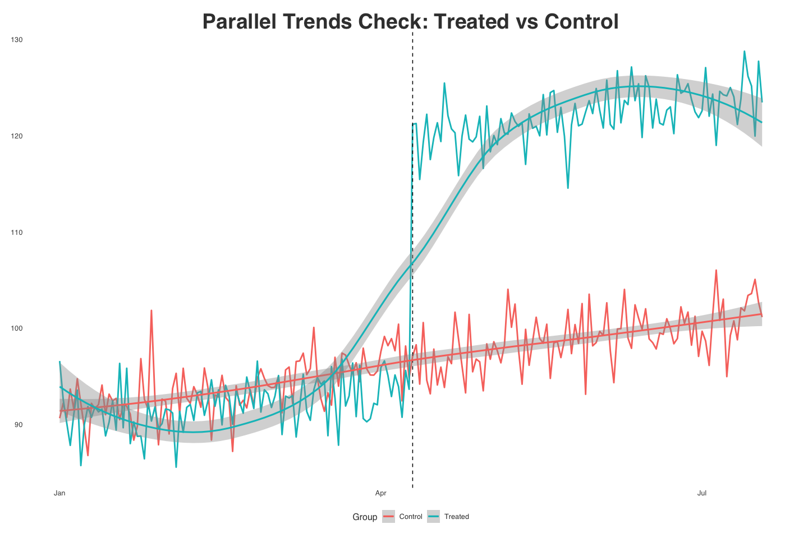
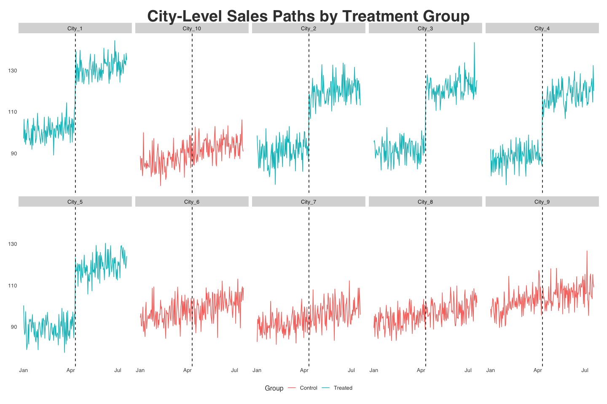
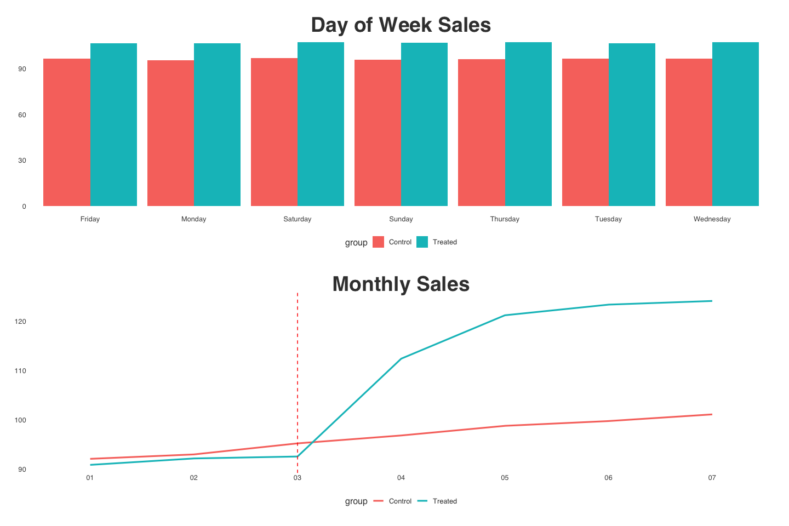
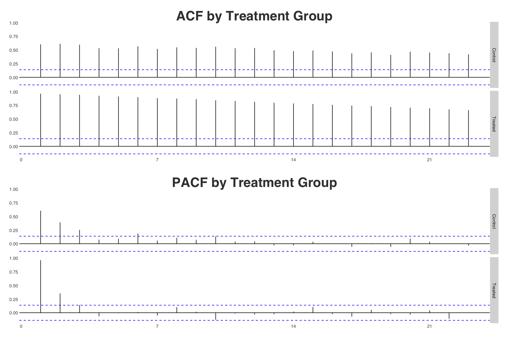
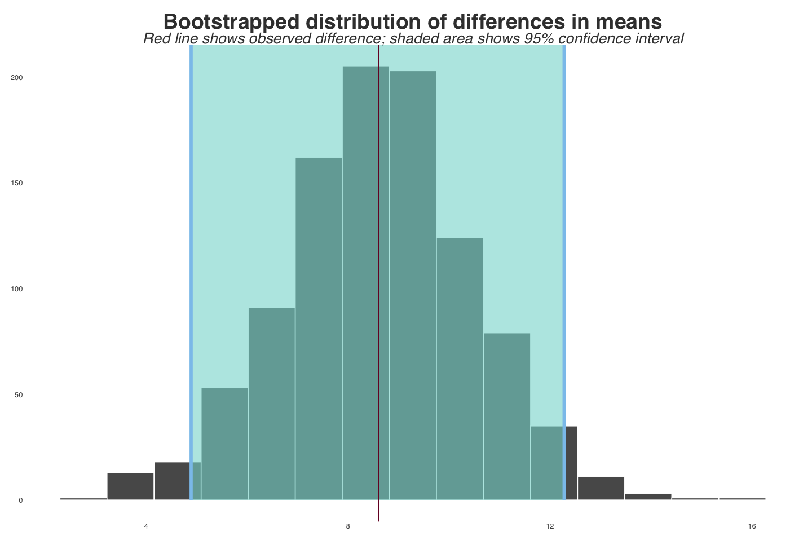
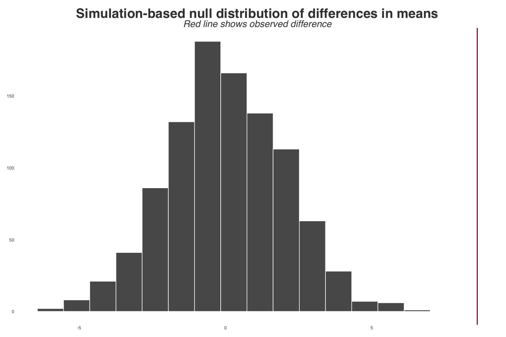
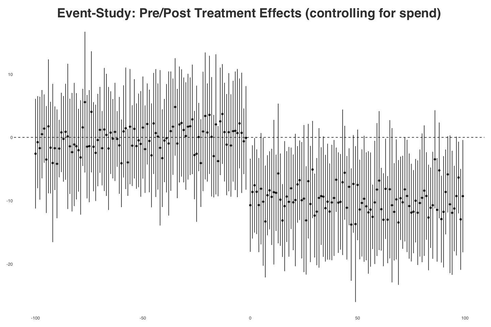
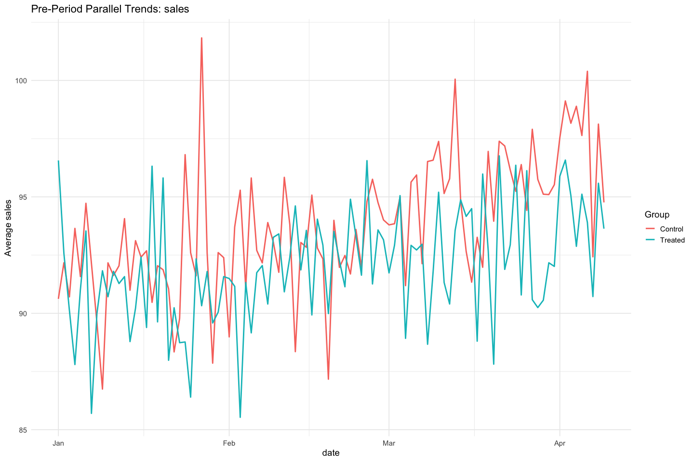
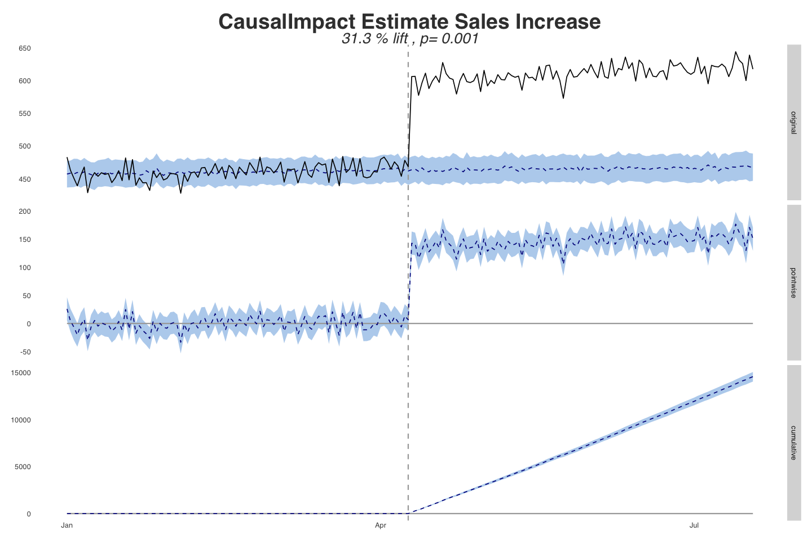

Parallel Trends Pre-Checks
================

In this script we walk through boilerplate causal pre-checks to
determine if our data meets the parallel trends assumption in the pre
period. We only look at the most essential functions as there are many
more esoteric checks contained in our helper script documented below
that are likely not always necessary. Please see the appendix for a list
of functions and their use.

###### Steps

1.  Basic visual inspection of pre/post campaign to examine parallel
    trends assumption.
2.  Analysis of variance in pre/post sales data.
3.  Optional: Event study comparison to determine the difference between
    between pre/post, which helps us determine if the difference is a
    function of surrounding time periods OR the intervention.
4.  We use linear regression to compare pre-intervention trends between
    groups.

``` r
# Load required packages
packages <- c(
  "dplyr",
  "tidyr",
  "tidyverse",
  "patchwork",
  "broom",
  "CausalImpact",
  "scales",
  "lubridate",
  "lmtest",
  "sandwich",
  "fixest",
  "car",
  "feasts",
  "infer",
  "corrr",
  "kableExtra"
)

installed <- rownames(installed.packages())
to_install <- setdiff(packages, installed)

if (length(to_install) > 0) {
  install.packages(to_install)
}

suppressPackageStartupMessages(
  lapply(packages, library, character.only = TRUE)
)
```

    ## [[1]]
    ## [1] "dplyr"     "stats"     "graphics"  "grDevices" "utils"     "datasets" 
    ## [7] "methods"   "base"     
    ## 
    ## [[2]]
    ## [1] "tidyr"     "dplyr"     "stats"     "graphics"  "grDevices" "utils"    
    ## [7] "datasets"  "methods"   "base"     
    ## 
    ## [[3]]
    ##  [1] "lubridate" "forcats"   "stringr"   "purrr"     "readr"     "tibble"   
    ##  [7] "ggplot2"   "tidyverse" "tidyr"     "dplyr"     "stats"     "graphics" 
    ## [13] "grDevices" "utils"     "datasets"  "methods"   "base"     
    ## 
    ## [[4]]
    ##  [1] "patchwork" "lubridate" "forcats"   "stringr"   "purrr"     "readr"    
    ##  [7] "tibble"    "ggplot2"   "tidyverse" "tidyr"     "dplyr"     "stats"    
    ## [13] "graphics"  "grDevices" "utils"     "datasets"  "methods"   "base"     
    ## 
    ## [[5]]
    ##  [1] "broom"     "patchwork" "lubridate" "forcats"   "stringr"   "purrr"    
    ##  [7] "readr"     "tibble"    "ggplot2"   "tidyverse" "tidyr"     "dplyr"    
    ## [13] "stats"     "graphics"  "grDevices" "utils"     "datasets"  "methods"  
    ## [19] "base"     
    ## 
    ## [[6]]
    ##  [1] "CausalImpact"  "bsts"          "xts"           "zoo"          
    ##  [5] "BoomSpikeSlab" "Boom"          "broom"         "patchwork"    
    ##  [9] "lubridate"     "forcats"       "stringr"       "purrr"        
    ## [13] "readr"         "tibble"        "ggplot2"       "tidyverse"    
    ## [17] "tidyr"         "dplyr"         "stats"         "graphics"     
    ## [21] "grDevices"     "utils"         "datasets"      "methods"      
    ## [25] "base"         
    ## 
    ## [[7]]
    ##  [1] "scales"        "CausalImpact"  "bsts"          "xts"          
    ##  [5] "zoo"           "BoomSpikeSlab" "Boom"          "broom"        
    ##  [9] "patchwork"     "lubridate"     "forcats"       "stringr"      
    ## [13] "purrr"         "readr"         "tibble"        "ggplot2"      
    ## [17] "tidyverse"     "tidyr"         "dplyr"         "stats"        
    ## [21] "graphics"      "grDevices"     "utils"         "datasets"     
    ## [25] "methods"       "base"         
    ## 
    ## [[8]]
    ##  [1] "scales"        "CausalImpact"  "bsts"          "xts"          
    ##  [5] "zoo"           "BoomSpikeSlab" "Boom"          "broom"        
    ##  [9] "patchwork"     "lubridate"     "forcats"       "stringr"      
    ## [13] "purrr"         "readr"         "tibble"        "ggplot2"      
    ## [17] "tidyverse"     "tidyr"         "dplyr"         "stats"        
    ## [21] "graphics"      "grDevices"     "utils"         "datasets"     
    ## [25] "methods"       "base"         
    ## 
    ## [[9]]
    ##  [1] "lmtest"        "scales"        "CausalImpact"  "bsts"         
    ##  [5] "xts"           "zoo"           "BoomSpikeSlab" "Boom"         
    ##  [9] "broom"         "patchwork"     "lubridate"     "forcats"      
    ## [13] "stringr"       "purrr"         "readr"         "tibble"       
    ## [17] "ggplot2"       "tidyverse"     "tidyr"         "dplyr"        
    ## [21] "stats"         "graphics"      "grDevices"     "utils"        
    ## [25] "datasets"      "methods"       "base"         
    ## 
    ## [[10]]
    ##  [1] "sandwich"      "lmtest"        "scales"        "CausalImpact" 
    ##  [5] "bsts"          "xts"           "zoo"           "BoomSpikeSlab"
    ##  [9] "Boom"          "broom"         "patchwork"     "lubridate"    
    ## [13] "forcats"       "stringr"       "purrr"         "readr"        
    ## [17] "tibble"        "ggplot2"       "tidyverse"     "tidyr"        
    ## [21] "dplyr"         "stats"         "graphics"      "grDevices"    
    ## [25] "utils"         "datasets"      "methods"       "base"         
    ## 
    ## [[11]]
    ##  [1] "fixest"        "sandwich"      "lmtest"        "scales"       
    ##  [5] "CausalImpact"  "bsts"          "xts"           "zoo"          
    ##  [9] "BoomSpikeSlab" "Boom"          "broom"         "patchwork"    
    ## [13] "lubridate"     "forcats"       "stringr"       "purrr"        
    ## [17] "readr"         "tibble"        "ggplot2"       "tidyverse"    
    ## [21] "tidyr"         "dplyr"         "stats"         "graphics"     
    ## [25] "grDevices"     "utils"         "datasets"      "methods"      
    ## [29] "base"         
    ## 
    ## [[12]]
    ##  [1] "car"           "carData"       "fixest"        "sandwich"     
    ##  [5] "lmtest"        "scales"        "CausalImpact"  "bsts"         
    ##  [9] "xts"           "zoo"           "BoomSpikeSlab" "Boom"         
    ## [13] "broom"         "patchwork"     "lubridate"     "forcats"      
    ## [17] "stringr"       "purrr"         "readr"         "tibble"       
    ## [21] "ggplot2"       "tidyverse"     "tidyr"         "dplyr"        
    ## [25] "stats"         "graphics"      "grDevices"     "utils"        
    ## [29] "datasets"      "methods"       "base"         
    ## 
    ## [[13]]
    ##  [1] "feasts"        "fabletools"    "car"           "carData"      
    ##  [5] "fixest"        "sandwich"      "lmtest"        "scales"       
    ##  [9] "CausalImpact"  "bsts"          "xts"           "zoo"          
    ## [13] "BoomSpikeSlab" "Boom"          "broom"         "patchwork"    
    ## [17] "lubridate"     "forcats"       "stringr"       "purrr"        
    ## [21] "readr"         "tibble"        "ggplot2"       "tidyverse"    
    ## [25] "tidyr"         "dplyr"         "stats"         "graphics"     
    ## [29] "grDevices"     "utils"         "datasets"      "methods"      
    ## [33] "base"         
    ## 
    ## [[14]]
    ##  [1] "infer"         "feasts"        "fabletools"    "car"          
    ##  [5] "carData"       "fixest"        "sandwich"      "lmtest"       
    ##  [9] "scales"        "CausalImpact"  "bsts"          "xts"          
    ## [13] "zoo"           "BoomSpikeSlab" "Boom"          "broom"        
    ## [17] "patchwork"     "lubridate"     "forcats"       "stringr"      
    ## [21] "purrr"         "readr"         "tibble"        "ggplot2"      
    ## [25] "tidyverse"     "tidyr"         "dplyr"         "stats"        
    ## [29] "graphics"      "grDevices"     "utils"         "datasets"     
    ## [33] "methods"       "base"         
    ## 
    ## [[15]]
    ##  [1] "corrr"         "infer"         "feasts"        "fabletools"   
    ##  [5] "car"           "carData"       "fixest"        "sandwich"     
    ##  [9] "lmtest"        "scales"        "CausalImpact"  "bsts"         
    ## [13] "xts"           "zoo"           "BoomSpikeSlab" "Boom"         
    ## [17] "broom"         "patchwork"     "lubridate"     "forcats"      
    ## [21] "stringr"       "purrr"         "readr"         "tibble"       
    ## [25] "ggplot2"       "tidyverse"     "tidyr"         "dplyr"        
    ## [29] "stats"         "graphics"      "grDevices"     "utils"        
    ## [33] "datasets"      "methods"       "base"         
    ## 
    ## [[16]]
    ##  [1] "kableExtra"    "corrr"         "infer"         "feasts"       
    ##  [5] "fabletools"    "car"           "carData"       "fixest"       
    ##  [9] "sandwich"      "lmtest"        "scales"        "CausalImpact" 
    ## [13] "bsts"          "xts"           "zoo"           "BoomSpikeSlab"
    ## [17] "Boom"          "broom"         "patchwork"     "lubridate"    
    ## [21] "forcats"       "stringr"       "purrr"         "readr"        
    ## [25] "tibble"        "ggplot2"       "tidyverse"     "tidyr"        
    ## [29] "dplyr"         "stats"         "graphics"      "grDevices"    
    ## [33] "utils"         "datasets"      "methods"       "base"

``` r
# Set seed for synthetic data gen and model fitting
set.seed(7)

# Load theme
source("/Users/karstenwalker/Documents/GitHub/R/Helpers/themes.R")

# Load causal pre-check function
source("/Users/karstenwalker/Documents/GitHub/R/Causal/causal_pre_check.R")

# Load optional group by functions
source("/Users/karstenwalker/Documents/GitHub/R/Causal/causal_by_group_functions_dev.R")
```

For this example we are going to generate synthetic data that contains
10 cities: 5 have been treated and 5 have not. We design the data such
that there are parallel pre-period trends and there is a significant
increase in only the treated cities. There is also a spend column which
differs across cities that we can add as a unit effect for a TWFE model.

``` r
n_days = 200
n_cities = 10
start_date = as.Date("2024-01-01")
intervention_date = start_date + 100

treated_cities = paste0("City_", 1:5)
control_cities = paste0("City_", 6:10)

beta_spend = 2
spend_jump = 8
epsilon_sd = 3
beta_treat_direct = 4            # deterministic immediate/direct lift
beta_city_shock = 5              # idiosyncratic city×date lift (survives FE)

sales_data =
  expand_grid(
    date = seq.Date(start_date, by = "day", length.out = n_days),
    city = paste0("City_", 1:n_cities)
  ) %>%
  mutate(
    city = factor(city),
    treat = if_else(city %in% treated_cities, 1L, 0L),
    post = if_else(date >= intervention_date, 1L, 0L),
    day_index = as.integer(date - start_date),
    city_effect = rnorm(n_cities, sd = 4)[as.integer(city)],
    common_trend = 0.05 * day_index,
    spend = rnorm(n(), mean = 20, sd = 2),
    epsilon = rnorm(n(), sd = epsilon_sd)
  ) %>%
  group_by(post, treat) %>%
  mutate(spend_grp_mean = mean(spend)) %>%
  ungroup() %>%
  group_by(post) %>%
  mutate(spend_overall_pre = if_else(post == 0, mean(spend[post == 0]), NA_real_)) %>%
  ungroup() %>%
  mutate(
    spend_balanced = if_else(post == 0,
                             spend - (spend_grp_mean - spend_overall_pre),
                             spend
    ),
    spend = spend_balanced + spend_jump * treat * post,
    treat_city_shock = beta_city_shock * rnorm(n(), mean = 1, sd = 0.2) * treat * post,
    sales =
      50 +
      city_effect +
      common_trend +
      beta_spend * spend +
      beta_treat_direct * treat * post +
      treat_city_shock +
      epsilon,
    rel_time = as.integer(date - intervention_date)
  ) %>%
  select(date, city, treat, post, rel_time, spend, sales)%>%
  mutate(treat=as.factor(treat))
```

Let’s check out our data real quick

``` r
report::report(sales_data%>%
                 select(-date))
```

    ## The data contains 2000 observations of the following 6 variables:
    ## 
    ##   - city: 10 levels, namely City_1 (n = 200, 10.00%), City_10 (n = 200, 10.00%),
    ## City_2 (n = 200, 10.00%), City_3 (n = 200, 10.00%), City_4 (n = 200, 10.00%),
    ## City_5 (n = 200, 10.00%), City_6 (n = 200, 10.00%), City_7 (n = 200, 10.00%),
    ## City_8 (n = 200, 10.00%) and City_9 (n = 200, 10.00%)
    ##   - treat: 2 levels, namely 0 (n = 1000, 50.00%) and 1 (n = 1000, 50.00%)
    ##   - post: n = 2000, Mean = 0.50, SD = 0.50, Median = 0.50, MAD = 0.74, range: [0,
    ## 1], Skewness = 0.00, Kurtosis = -2.00, 0% missing
    ##   - rel_time: n = 2000, Mean = -0.50, SD = 57.75, Median = -0.50, MAD = 74.13,
    ## range: [-100, 99], Skewness = 0.00, Kurtosis = -1.20, 0% missing
    ##   - spend: n = 2000, Mean = 22.02, SD = 3.99, Median = 20.90, MAD = 3.14, range:
    ## [13.61, 34.99], Skewness = 0.76, Kurtosis = -0.34, 0% missing
    ##   - sales: n = 2000, Mean = 101.71, SD = 13.86, Median = 97.85, MAD = 12.00,
    ## range: [74.17, 144.40], Skewness = 0.70, Kurtosis = -0.42, 0% missing

``` r
sales_data %>%
  group_by(treat, city) %>%
  summarize(
    mean_sales = mean(sales, na.rm = TRUE),
    med_sales = median(sales, na.rm = TRUE),
    min_sales= min(sales, na.rm = TRUE),
    max_sales= max(sales, na.rm = TRUE),
    sd_sales = sd(sales),
    min_date = min(date),
    max_date = max(date)
  )%>%
  arrange(city, treat)
```

    ## # A tibble: 10 × 9
    ## # Groups:   treat [2]
    ##    treat city    mean_sales med_sales min_sales max_sales sd_sales min_date  
    ##    <fct> <fct>        <dbl>     <dbl>     <dbl>     <dbl>    <dbl> <date>    
    ##  1 1     City_1       116.      119.       89.0      144.    15.8  2024-01-01
    ##  2 0     City_10       90.0      90.1      74.2      106.     5.92 2024-01-01
    ##  3 1     City_2       105.      105.       74.8      134.    15.8  2024-01-01
    ##  4 1     City_3       107.      106.       81.6      143.    15.9  2024-01-01
    ##  5 1     City_4       103.      103.       74.5      132.    16.0  2024-01-01
    ##  6 1     City_5       104.      103.       77.4      130.    15.9  2024-01-01
    ##  7 0     City_6        98.2      98.1      84.2      113.     5.91 2024-01-01
    ##  8 0     City_7        94.1      93.5      81.3      112.     5.97 2024-01-01
    ##  9 0     City_8        95.8      95.8      83.1      110.     5.42 2024-01-01
    ## 10 0     City_9       104.      104.       89.4      127.     5.86 2024-01-01
    ## # ℹ 1 more variable: max_date <date>

Looks good, no missingness and plenty of variation that we built in.

Overall pre/post visual check

``` r
sales_data %>%
  mutate(group = if_else(treat == 1, "Treated", "Control")) %>%
  group_by(date, group) %>%
  summarize(avg_sales = mean(sales), .groups = "drop") %>%
  ggplot(aes(x = date, y = avg_sales, color = group)) +
  geom_line(linewidth = 1) +
  geom_vline(xintercept = intervention_date, linetype = "dashed") +
  geom_smooth()+
  labs(
    title = "Parallel Trends Check: Treated vs Control",
    x = "Date",
    y = "Average Daily Sales",
    color = "Group"
  ) +
  theme_fancy()
```

<!-- -->

Now by city

``` r
sales_data %>%
  mutate(group = if_else(treat == 1, "Treated", "Control")) %>%
  ggplot(aes(x = date, y = sales, color = group)) +
  geom_line()+
  geom_vline(xintercept = intervention_date, linetype = "dashed") +
  facet_wrap(~ city, ncol = 5) +
  labs(
    title = "City-Level Sales Paths by Treatment Group",
    x = "Date",
    y = "Daily Sales",
    color = "Group"
  ) +
  theme_fancy()
```

<!-- -->

Let’s check the distribution of sales, which should be fairly similar
with a slightly different mean.

``` r
ggplot(sales_data%>%
         filter(post==0), aes(x = as.factor(treat), y = sales, fill=factor(treat)))+
  geom_violin(draw_quantiles = c(0.5))+
  labs(title="Sales Distribution",
       subtitle="Pre/Post")+
  theme_fancy()+
  theme(legend.title=element_blank())
```

<!-- -->

The first thing we need to do is check for equal variance in the
pre-period. If the p-value of Levene’s test is \<.05 then we can reject
the null hypothesis that variance is equal.

``` r
leveneTest(sales ~ factor(treat), data = sales_data%>%
             filter(post==0), center = median)
```

    ## Levene's Test for Homogeneity of Variance (center = median)
    ##        Df F value Pr(>F)
    ## group   1  1.0542 0.3048
    ##       998

Levene’s test shows a non-sig p-value, so we conclude that the null
hypothesis that variance is equal is correct.

If we had non-normal data we could run Fligner’s test

``` r
# Non-normal data
fligner.test(sales ~ factor(treat), data = sales_data%>%
               filter(post==0))
```

    ## 
    ##  Fligner-Killeen test of homogeneity of variances
    ## 
    ## data:  sales by factor(treat)
    ## Fligner-Killeen:med chi-squared = 1.0067, df = 1, p-value = 0.3157

Quick visual seasonality check shows there is not day-of-week
seasonality, but clear seasonality we baked into the data. We added a
noise component so that we can identify if these checks are able to
separate out normal variance over a longer period.

``` r
# Day-of-week
day<-sales_data %>%
  mutate(group = if_else(treat==1,"Treated","Control"),
         wday = weekdays(date)) %>%
  group_by(wday, group) %>%
  summarize(mean_sales = mean(sales)) %>%
  ggplot(aes(wday, mean_sales, fill = group)) +
  geom_col(position = position_dodge())+
  labs( title = "Day of Week Sales",
        x = "Group (0 = Control, 1 = Treated)",
        y = "Sales") +
  theme_fancy()

# Month
mo<-sales_data %>%
  mutate(group = if_else(treat==1,"Treated","Control"),
         month = format(date, "%m")) %>%
  group_by(month, group) %>%
  summarize(mean_sales = mean(sales)) %>%
  ggplot(aes(month, mean_sales, group=group, color=group)) + 
  geom_line(size=1.1)+
  geom_vline(xintercept = 3, linetype="dashed", color="red") +
  labs( title = "Monthly Sales",
        x = "Group (0 = Control, 1 = Treated)",
        y = "Sales") +
  theme_fancy()

day/mo
```

<!-- -->

The next thing we need to do is check for auto-correlation between time
series. This would be a concern if we introduced some kind of incentive
for the treatment and there was contamination in the control and
potential exposure from network effects or de-linked user/session IDs.

``` r
library(feasts) 

sales_ts <- sales_data %>%
  mutate(group = if_else(treat==1,"Treated","Control"))%>%
  group_by(date, group)%>%
  summarize(sales=sum(sales))%>%
  ungroup()%>%
  as_tsibble(key = group, index = date)   

# ACF
acf_df <- sales_ts %>%
  ACF(sales)

# PACF
pacf_df <- sales_ts %>%
  PACF(sales)

# Plot
acf_fig <- acf_df %>%
  autoplot() +
  labs(title = "ACF by Treatment Group")+
  theme_fancy()

pacf_fig <- pacf_df %>%
  autoplot()+
  labs(title = "PACF by Treatment Group")+
  theme_fancy()

acf_fig/pacf_fig
```

<!-- -->

Nothing alarming that we did not already know from the DGP.

If the data is IID and satisfies SUTVA we can use difference-in-means
and a T-test to measure pre/post diff

``` r
diff_means <- sales_data %>%
  filter(post==0)%>%
  group_by(date, treat)%>%
  summarize(sales=sum(sales))%>%
  ungroup()%>%
  specify(sales ~ treat) %>%
  calculate("diff in means")

diff_means
```

    ## Response: sales (numeric)
    ## Explanatory: treat (factor)
    ## # A tibble: 1 × 1
    ##    stat
    ##   <dbl>
    ## 1  8.60

There is a difference, now let’s run 1K bootstrap samples to get
confidence intervals around our difference.

``` r
boot_means <- sales_data %>%
  filter(post==0)%>%
  group_by(date, treat)%>%
  summarize(sales=sum(sales))%>%
  ungroup()%>%
  specify(sales ~ treat)%>%
  infer::generate(reps = 1000, type = "bootstrap") %>% 
  calculate("diff in means")

boostrapped_confint <- boot_means%>%
  get_confidence_interval()

boot_means %>% 
  visualize() + 
  shade_confidence_interval(boostrapped_confint,
                            color = "#8bc5ed", fill = "#85d9d2") +
  geom_vline(xintercept = diff_means$stat, size = 1, color = "#77002c") +
  labs(title = "Bootstrapped distribution of differences in means",
       x = "Treat - Untreated", y = "Count",
       subtitle = "Red line shows observed difference; shaded area shows 95% confidence interval") +
  theme_fancy()
```

<!-- -->

Next we create a null distribution to check if our observed mean
differnce is within the distribution.

``` r
diffs_null <- sales_data %>%
  filter(post==0)%>%
  group_by(date, treat)%>%
  summarize(sales=sum(sales))%>%
  ungroup()%>%
  specify(sales ~ treat) %>% 
  infer::hypothesize(null = "independence") %>% 
  infer::generate(reps = 1000, type = "permute") %>% 
  calculate("diff in means")

diffs_null %>% 
  visualize() + 
  geom_vline(xintercept = diff_means$stat, size = 1, color = "#77002c") +
  scale_y_continuous(labels = comma) +
  labs(x = "Simulated difference in sales (Treated - Untreated)", y = "Count",
       title = "Simulation-based null distribution of differences in means",
       subtitle = "Red line shows observed difference") +
  theme_fancy()
```

<!-- -->

``` r
diffs_null %>% 
  infer::get_p_value(obs_stat = diff_means, direction = "both")
```

    ## # A tibble: 1 × 1
    ##   p_value
    ##     <dbl>
    ## 1       0

Our p-value of zero suggests that the effect cannot exist in the null
world.

The last check I like to do is the Kolmogorov–Smirnov (KS) Test A KS
test is a comparison of the CDF of both datasets. We use this test
because we want to know about more than just the mean, but how the tails
of the dataset differ. This tells us if the datasets are structurally
different across the entire range of observations. Additionally the KS
test makes no assumptions about normality, equal variances, or linear
relationships. It shows WHERE the groups differ.

``` r
# Grid of sales values
grid <- sales_data %>% 
  filter(post==0)%>%
  distinct(sales) %>% 
  arrange(sales)

# Define ECDF functions for each group
ecdf_treated_fun <- ecdf(sales_data$sales[sales_data$treat == 1])
ecdf_control_fun <- ecdf(sales_data$sales[sales_data$treat == 0])

# Wide ECDF data (one row per sales value, columns for each group's ECDF)
ecdf_wide <- grid %>%
  mutate(ecdf_treated = ecdf_treated_fun(sales),
         ecdf_control = ecdf_control_fun(sales),
         diff = abs(ecdf_treated - ecdf_control)
  )

# KS point (where the ECDF difference is maximal)
ks_point <- ecdf_wide %>% 
  slice_max(diff, n = 1)

# Long-format ECDF data frame used in ggplot
ecdf_wide %>%
  pivot_longer(cols  = c(ecdf_treated, ecdf_control),
               names_to  = "treat",
               values_to = "ecdf",
               names_prefix = "ecdf_" ) %>%
  mutate(
    treat = dplyr::case_when(
      treat == "treated" ~ "Treated",
      treat == "control" ~ "Control",
      TRUE ~ treat))%>%
  ggplot() +
  geom_step(
    aes(x = sales, y = ecdf, color = treat),
    linewidth = 1) +
  geom_segment(
    data = ks_point,
    aes(x = sales, xend = sales,
        y = ecdf_treated, yend = ecdf_control),
    color = "black", linetype = "dashed", linewidth=1) +
  annotate(
    "text",
    x = ks_point$sales,
    y = max(ks_point$ecdf_treated, ks_point$ecdf_control),
    label = paste0("KS = ", round(ks_point$diff, 3)),
    vjust = -0.5, hjust = -0.2,
    size = 5) +
  labs(
    title = "Kolmogorov–Smirnov Test Visualization",
    subtitle = "ECDF Comparison: Treated vs Control",
    x = "Sales",
    y = "ECDF",
    color = "Group") +
  theme_fancy() +
  scale_color_manual(
    values = c("Control" = "#1f78b4",
               "Treated" = "#e31a1c"))
```

<!-- -->

Cool, more of what we know, there is a mean difference between the two
datasets, but the tails are similar. This demonstrates an average effect
with no skewness.

Finally we run an Event Study, which is really just a fancy form of
linear regression, but provides us with cluster-robust standard errors
because we have multiple treated and control units. If we just had 1 of
each we could just use regression with the equation sales ~ post. We are
careful to estimate the treatment effect in treated vs control for every
relative time period around the intervention. The coefficients should
cluster around 0.

``` r
# Create relative time (days to/from intervention)
sales_data <- sales_data %>%
  mutate(rel_time = as.integer(date - intervention_date))

es_nospend <- feols(
  sales ~ i(rel_time, treat, ref = -1) | city + date,
  data = sales_data, cluster = "city"
)

es_spend <- feols(
  sales ~ spend + i(rel_time, treat, ref = -1) | city + date,
  data = sales_data, cluster = "city"
)

event_df_spend <- broom::tidy(es_spend, conf.int = TRUE) %>%
  filter(str_detect(term, "rel_time")) %>%
  mutate(rel_time = as.integer(str_extract(term, "-?\\d+"))) %>%
  arrange(rel_time)

ggplot(event_df_spend, aes(x = rel_time, y = estimate)) +
  geom_hline(yintercept = 0, linetype = "dashed") +
  geom_point() +
  geom_errorbar(aes(ymin = conf.low, ymax = conf.high), width = 0.2) +
  labs(
    title = "Event-Study: Pre/Post Treatment Effects (controlling for spend)",
    x = "Days Relative to Campaign",
    y = "Estimated Effect on Sales"
  ) +
  theme_fancy()
```

<!-- -->

For learning’s sake here is what regression would look like

``` r
# Regression, no spend
pre_data <- sales_data %>% filter(post == 0)

pre_trend_test <- lm(sales ~ as.numeric(date) * treat,
                     data = pre_data)

summary(pre_trend_test)
```

    ## 
    ## Call:
    ## lm(formula = sales ~ as.numeric(date) * treat, data = pre_data)
    ## 
    ## Residuals:
    ##      Min       1Q   Median       3Q      Max 
    ## -18.9676  -4.7227  -0.3193   4.6476  21.4335 
    ## 
    ## Coefficients:
    ##                           Estimate Std. Error t value Pr(>|t|)    
    ## (Intercept)             -1.060e+03  2.068e+02  -5.124 3.59e-07 ***
    ## as.numeric(date)         5.834e-02  1.046e-02   5.578 3.14e-08 ***
    ## treat1                   5.015e+02  2.925e+02   1.715   0.0867 .  
    ## as.numeric(date):treat1 -2.545e-02  1.479e-02  -1.720   0.0857 .  
    ## ---
    ## Signif. codes:  0 '***' 0.001 '**' 0.01 '*' 0.05 '.' 0.1 ' ' 1
    ## 
    ## Residual standard error: 6.751 on 996 degrees of freedom
    ## Multiple R-squared:  0.05434,    Adjusted R-squared:  0.05149 
    ## F-statistic: 19.08 on 3 and 996 DF,  p-value: 4.928e-12

``` r
report::report(pre_trend_test)
```

    ## We fitted a linear model (estimated using OLS) to predict sales with date and
    ## treat (formula: sales ~ as.numeric(date) * treat). The model explains a
    ## statistically significant and weak proportion of variance (R2 = 0.05, F(3, 996)
    ## = 19.08, p < .001, adj. R2 = 0.05). The model's intercept, corresponding to
    ## date = [?] and treat = 0, is at -1059.77 (95% CI [-1465.62, -653.93], t(996) =
    ## -5.12, p < .001). Within this model:
    ## 
    ##   - The effect of date is statistically significant and positive (beta = 0.06,
    ## 95% CI [0.04, 0.08], t(996) = 5.58, p < .001; Std. beta = 0.24, 95% CI [0.16,
    ## 0.33])
    ##   - The effect of treat [1] is statistically non-significant and positive (beta =
    ## 501.48, 95% CI [-72.47, 1075.44], t(996) = 1.71, p = 0.087; Std. beta = -0.25,
    ## 95% CI [-0.37, -0.13])
    ##   - The effect of date × treat [1] is statistically non-significant and negative
    ## (beta = -0.03, 95% CI [-0.05, 3.58e-03], t(996) = -1.72, p = 0.086; Std. beta =
    ## -0.11, 95% CI [-0.23, 0.01])
    ## 
    ## Standardized parameters were obtained by fitting the model on a standardized
    ## version of the dataset. 95% Confidence Intervals (CIs) and p-values were
    ## computed using a Wald t-distribution approximation.

That’s it! We have accounted for:

- Equal variance in the pre-period.
- Autocorrelation.
- A consistent difference in the pre-period trend.
- Determining if the difference is significant with either an Event
  Study or Linear Regression.

Now instead of running this code over and over I have written a helper
function that runs all these tests and returns the results.

``` r
diag_results <- pre_treatment_diagnostics(
  data = sales_data%>%
    filter(post==0),
  outcome = "sales",
  treat = "treat",
  time = "date",
  post = "post",
  intervention_date = intervention_date,  
  do_event_study = TRUE                  
)
```

    ## 
    ## === Pre-Treatment Diagnostics ===
    ## Equal-means t-test (sales): p-value = 8.27e-05
    ## Levene's test (variance equal): p-value = 0.305
    ## Fligner–Killeen test (variance equal): p-value = 0.316
    ## KS test (distributional equality, treated vs control): p-value = 0.000329
    ## Parallel-trend slope test (time*treat interaction): p-value = 3.14e-08
    ## Event study model estimated: yes (use iplot(results$event_study_model))
    ## =================================

This function returns a pre-period parallel trends plot

``` r
diag_results$pre_trends_plot
```

<!-- -->

and all other plots!

``` r
diag_results$pre_trends_plot
```

<!-- -->

``` r
diag_results$ks_ecdf_plot
```

    ## NULL

``` r
diag_results$ks_density_plot
```

    ## NULL

``` r
diag_results$ slope_comparison_plot
```

    ## NULL

``` r
diag_results$event_study_plot  
```

    ## NULL

``` r
summary(diag_results$slope_model)
```

    ## 
    ## Call:
    ## stats::lm(formula = slope_formula, data = pre_data)
    ## 
    ## Residuals:
    ##      Min       1Q   Median       3Q      Max 
    ## -18.9676  -4.7227  -0.3193   4.6476  21.4335 
    ## 
    ## Coefficients:
    ##                                   Estimate Std. Error t value Pr(>|t|)    
    ## (Intercept)                     -1.060e+03  2.068e+02  -5.124 3.59e-07 ***
    ## as.numeric(date)                 5.834e-02  1.046e-02   5.578 3.14e-08 ***
    ## factor(treat)1                   5.015e+02  2.925e+02   1.715   0.0867 .  
    ## as.numeric(date):factor(treat)1 -2.545e-02  1.479e-02  -1.720   0.0857 .  
    ## ---
    ## Signif. codes:  0 '***' 0.001 '**' 0.01 '*' 0.05 '.' 0.1 ' ' 1
    ## 
    ## Residual standard error: 6.751 on 996 degrees of freedom
    ## Multiple R-squared:  0.05434,    Adjusted R-squared:  0.05149 
    ## F-statistic: 19.08 on 3 and 996 DF,  p-value: 4.928e-12

We can even inspect Levene’s test results. All of the tests above are
objects of the data frame that the function outputs.

``` r
diag_results$levene_test
```

    ## Levene's Test for Homogeneity of Variance (center = median)
    ##        Df F value Pr(>F)
    ## group   1  1.0542 0.3048
    ##       998

If we want to get really fancy we could use CausalImpact to also answer
if there was a significant difference in only the post period. We pass
the function the treatment time series as the first column and the
control series is used as a covariate.

``` r
sales_control<-sales_data%>%
  filter(treat==0)%>%
  group_by(date)%>%
  summarize(control_sales=sum(sales),
            control_spend=sum(spend))%>%
  ungroup()

sales_treat<-sales_data%>%
  filter(treat==1)%>%
  group_by(date)%>%
  summarize(treat_sales=sum(sales),
            treat_spend=sum(spend))%>%
  ungroup()

# Define pre- and post-intervention periods 
dates <- seq.Date(as.Date(min(sales_treat$date)),
                  by=1, 
                  length.out = length(sales_treat$date))

pre_period <- as.Date(c(min(sales_treat$date), intervention_date-1))

post_period <- as.Date(c(intervention_date, max(sales_treat$date)))

sales_zoo<-zoo(cbind(sales_treat$treat_sales, 
                     sales_control$control_sales), order.by=dates)

# Causal for non smoothed data
sales_impact <- CausalImpact(sales_zoo, pre_period, post_period)

# Results summary
summary(sales_impact, "report")
```

    ## Analysis report {CausalImpact}
    ## 
    ## 
    ## During the post-intervention period, the response variable had an average value of approx. 610.52. By contrast, in the absence of an intervention, we would have expected an average response of 465.14. The 95% interval of this counterfactual prediction is [460.27, 470.40]. Subtracting this prediction from the observed response yields an estimate of the causal effect the intervention had on the response variable. This effect is 145.39 with a 95% interval of [140.13, 150.25]. For a discussion of the significance of this effect, see below.
    ## 
    ## Summing up the individual data points during the post-intervention period (which can only sometimes be meaningfully interpreted), the response variable had an overall value of 61.05K. By contrast, had the intervention not taken place, we would have expected a sum of 46.51K. The 95% interval of this prediction is [46.03K, 47.04K].
    ## 
    ## The above results are given in terms of absolute numbers. In relative terms, the response variable showed an increase of +31%. The 95% interval of this percentage is [+30%, +33%].
    ## 
    ## This means that the positive effect observed during the intervention period is statistically significant and unlikely to be due to random fluctuations. It should be noted, however, that the question of whether this increase also bears substantive significance can only be answered by comparing the absolute effect (145.39) to the original goal of the underlying intervention.
    ## 
    ## The probability of obtaining this effect by chance is very small (Bayesian one-sided tail-area probability p = 0.001). This means the effect is statistically significant. It can be considered causal if the model assumptions are satisfied. For more details, including the model assumptions behind the method, see https://google.github.io/CausalImpact/.

``` r
# Plot
plot(sales_impact)+
  theme_fancy()+
  labs(x="Date",
       y="Effect",
       title="CausalImpact Estimate Sales Increase",
       subtitle=paste(round(sales_impact$summary$RelEffect,3)*100,
                      "% lift",
                      ",", 
                      "p=",
                      round(sales_impact$summary$p,3)))
```

<!-- -->

## Diagnostic summary table

``` r
# A single index table that shows what each pre-check produces.
# This is useful when training new analysts so they know what to inspect (and where).

suppressPackageStartupMessages({
  library(dplyr)
  library(tidyr)
  library(purrr)
  library(stringr)
  library(knitr)
  library(tibble)
})

diagnostic_catalog <- tibble::tribble(
  ~test_id, ~test_name, ~objects,
  "Pre-period subset", c("pre_data"),
  "Equal-means t-test", c("mean_test"),
  "Levene’s test for equal variance", c("levene_test"),
  "Fligner–Killeen test for equal variance", c("fligner_test"),
  "Two-sample KS test", c("ks_test"),
  "KS ECDF plot", c("ks_ecdf_plot"),
  "KS density plot", c("ks_density_plot"),
  "Parallel-trend slope test", c("slope_model", "slope_p_value"),
  "Slope comparison plot", c("slope_comparison_plot"),
  "Pre-period parallel trends plot", c("pre_trends_plot"),
  "Nonlinear shape check via spline interaction", c("curvature_model", "curvature_p_value"),
  "Curvature plot", c("curvature_plot"),
  "Seasonality-adjusted slope test", c("seasonality_slope_model", "seasonality_slope_p_value"),
  "Seasonality-adjusted trends plot", c("seasonality_slope_plot"),
  "Calendar composition balance test", c("calendar_balance_test", "calendar_balance_p_value"),
  "Rolling-window KS distance", c("rolling_distance_df", "ks_D"),
  "Rolling-window Wasserstein distance", c("rolling_distance_df", "wasserstein"),
  "Rolling-distance plot", c("rolling_distance_plot"),
  "Unit-level pre slope distribution comparison", c("unit_slope_df", "unit_slope_t_test", "unit_slope_ks_test"),
  "Unit-level slope distribution plot", c("unit_slope_plot"),
  "Robust slope interaction", c("robust_slope_model", "robust_interaction_p"),
  "Influence diagnostics", c("cooks_plot", "top_influential"),
  "Pre-only placebo event study", c("placebo_event_study_model", "placebo_event_study_plot"),
  "Joint test of placebo leads", c("placebo_leads_joint_test", "placebo_leads_p_value")
)

diagnostic_table <- diagnostic_catalog %>%
  tidyr::unnest_longer(objects, values_to = "object") %>%
  mutate(
    present = purrr::map_lgl(object, ~ !is.null(diag_results[[.x]])),
    classes = purrr::map_chr(
      object,
      ~ if (!is.null(diag_results[[.x]])) paste(class(diag_results[[.x]]), collapse = ", ") else NA_character_
    ),
    preview = purrr::map_chr(
      object,
      ~ {
        x <- diag_results[[.x]]
        if (is.null(x)) return("")
        if (is.atomic(x) && length(x) == 1) return(as.character(x))
        if (inherits(x, "htest")) return(paste0("p=", signif(x$p.value, 3)))
        ""
      }
    )
  ) %>%
  group_by(test_id, test_name) %>%
  summarize(
    objects = paste(object, collapse = ", "),
    status  = if_else(all(present), "available", "missing (object not returned)"),
    classes = paste(na.omit(unique(classes)), collapse = " | "),
    preview = paste(preview[preview != ""], collapse = "; "),
    .groups = "drop"
  ) %>%
  arrange(test_id)

knitr::kable(
  diagnostic_table,
  align = c("r", "l", "l", "l", "l", "l"),
  caption = "Pre-treatment diagnostics produced by `pre_treatment_diagnostics()`"
)
```

| test_id | test_name | objects | status | classes | preview |
|---:|:---|:---|:---|:---|:---|
| Pre-period subset | pre_data | Equal-means t-test | missing (object not returned) |  |  |
| mean_test | Levene’s test for equal variance | levene_test | available | anova, data.frame |  |
| Fligner–Killeen test for equal variance | fligner_test | Two-sample KS test | missing (object not returned) |  |  |
| ks_test | KS ECDF plot | ks_ecdf_plot | missing (object not returned) |  |  |
| KS density plot | ks_density_plot | Parallel-trend slope test | missing (object not returned) |  |  |
| slope_model , slope_p_value | Slope comparison plot | slope_comparison_plot | missing (object not returned) |  |  |
| Pre-period parallel trends plot | pre_trends_plot | Nonlinear shape check via spline interaction | missing (object not returned) |  |  |
| curvature_model , curvature_p_value | Curvature plot | curvature_plot | missing (object not returned) |  |  |
| Seasonality-adjusted slope test | seasonality_slope_model , seasonality_slope_p_value | Seasonality-adjusted trends plot | missing (object not returned) |  |  |
| seasonality_slope_plot | Calendar composition balance test | calendar_balance_test, calendar_balance_p_value | missing (object not returned) |  |  |
| Rolling-window KS distance | rolling_distance_df, ks_D | Rolling-window Wasserstein distance | missing (object not returned) |  |  |
| rolling_distance_df, wasserstein | Rolling-distance plot | rolling_distance_plot | missing (object not returned) |  |  |
| Unit-level pre slope distribution comparison | unit_slope_df , unit_slope_t_test , unit_slope_ks_test | Unit-level slope distribution plot | missing (object not returned) |  |  |
| unit_slope_plot | Robust slope interaction | robust_slope_model, robust_interaction_p | missing (object not returned) |  |  |
| Influence diagnostics | cooks_plot , top_influential | Pre-only placebo event study | missing (object not returned) |  |  |
| placebo_event_study_model, placebo_event_study_plot | Joint test of placebo leads | placebo_leads_joint_test, placebo_leads_p_value | missing (object not returned) |  |  |

Pre-treatment diagnostics produced by `pre_treatment_diagnostics()`

## Appendix

Complete List of causal pre-checks available in the function 1.
Pre-period subset (pre_data): Filters the data to only observations
before treatment starts (where post == 0) so all diagnostics reflect
pre-treatment comparability rather than post effects. 2. Equal-means
t-test (mean_test): Tests whether the treated and control groups have
the same average outcome in the pre-period. A significant result
suggests baseline level differences that can make DiD estimates more
sensitive to functional form or weighting. 3. Levene’s test for equal
variance (levene_test): Tests whether the pre-period outcome variance is
the same in treated vs control (median-centered for robustness). Large
variance differences can indicate heteroskedasticity or fundamentally
different outcome volatility between groups. 4. Fligner–Killeen test for
equal variance (fligner_test): A nonparametric, robust test of whether
treated and control have equal pre-period variances. It’s less sensitive
to non-normality than Levene’s and is a good confirmation check for
variance imbalance. 5. Two-sample KS test (pooled pre) (ks_test): Tests
whether the entire pre-period outcome distributions differ between
treated and control, not just the means/variances. A significant KS
result flags distributional mismatch (e.g., different skew/tails) that
can violate the “comparability” intuition behind parallel trends. 6. KS
ECDF plot (ks_ecdf_plot): Visual companion to the KS test showing the
treated vs control empirical CDFs in pre-period. It helps identify where
the distributions diverge (e.g., lower tail vs upper tail), even when
p-values are borderline. 7. KS density plot (ks_density_plot): Visual
comparison of treated vs control pre-period densities. Useful for seeing
multimodality, heavy tails, or scaling differences that can hide behind
mean-based checks. 8. Parallel-trend slope test (linear interaction)
(slope_model, slope_p_value): Fits outcome ~ time \* treat on pre data
and tests whether the treated group’s trend slope differs from control
via the time×treat interaction. A significant interaction suggests a
violation of linear parallel trends in the pre-period. 9. Slope
comparison plot (slope_comparison_plot): Plots pre-period average
outcomes over time with separate fitted lines by group. It provides an
intuitive visual check of whether treated and control trends are aligned
and whether divergence is gradual or localized. 10. Pre-period parallel
trends plot (pre_trends_plot): Plots treated and control pre-period mean
outcomes over time without imposing a model, letting you visually assess
alignment, seasonality, and any obvious pre divergence. 11. Nonlinear
shape check via spline interaction (curvature_model, curvature_p_value):
Tests whether treated vs control differ in trend shape (curvature) in
the pre-period by interacting treatment with a flexible spline basis of
time. This catches non-parallel trends that aren’t well described by a
single linear slope difference. 12. Curvature plot (curvature_plot):
Visualizes potential nonlinear pre-trend differences by plotting group
averages with a smooth curve. It helps diagnose whether departures from
parallel trends are due to curvature/seasonality rather than a constant
slope gap. 13. Seasonality-adjusted slope test (seasonality_slope_model,
seasonality_slope_p_value): Re-runs the pre-period slope interaction
while controlling for calendar patterns (e.g., day-of-week and month
effects) so that “trend differences” aren’t just seasonality
differences. If the interaction becomes non-significant after
adjustment, the apparent violation may be seasonal rather than
structural. 14. Seasonality-adjusted trends plot
(seasonality_slope_plot): A visualization to accompany the
seasonality-adjusted slope test, helping you see whether divergence is
concentrated in specific calendar cycles even when overall pre trends
look similar. 15. Calendar composition balance test (chi-square on
day-of-week) (calendar_balance_test, calendar_balance_p_value): Tests
whether treated and control have different coverage/composition across
calendar categories (e.g., weekdays) in the pre-period. Imbalance can
create artificial trend differences if one group disproportionately
contains higher-variance or systematically higher/lower calendar days.
16. Rolling-window KS distance (rolling_distance_df / ks_D): Computes KS
distance in rolling pre-period windows to detect time-localized
distribution divergence (e.g., the last few pre weeks drifting). This is
useful when pooled pre-period KS looks fine but mismatch emerges closer
to treatment. 17. Rolling-window Wasserstein distance
(rolling_distance_df / wasserstein): Computes a magnitude-of-shift
metric (Earth-mover style) between treated and control distributions in
rolling windows. It’s often more interpretable than KS because it
reflects “how far” the distributions are apart, not only the maximum CDF
gap. 18. Rolling-distance plot (rolling_distance_plot): Plots rolling KS
and Wasserstein distances over pre time. Spikes or upward drift near the
intervention date are a red flag for emerging non-parallelism or
unobserved shocks affecting groups differently. 19. Unit-level pre slope
distribution comparison (unit_slope_df, unit_slope_t_test,
unit_slope_ks_test): Estimates a pre-period slope separately for each
unit and compares the distribution of unit slopes between treated and
control. This checks whether treated units are systematically on
different trajectories even if aggregate means look parallel. 20.
Unit-level slope distribution plot (unit_slope_plot): Visualizes
heterogeneity/composition differences by showing treated vs control
distributions of per-unit pre slopes (e.g., via violin/boxplot). It
helps detect whether imbalance is driven by a subset of units with
atypical trajectories. 21. Robust slope interaction (M-estimation via
rlm) (robust_slope_model, robust_interaction_p): Fits the same pre slope
interaction using a robust regression less sensitive to outliers and
heavy tails. If OLS shows a violation but robust does not (or vice
versa), results may be driven by a few extreme points. 22. Influence
diagnostics (Cook’s distance) (cooks_plot, top_influential): Measures
how much individual observations influence the pre-period slope model,
highlighting points that disproportionately drive the interaction term.
This helps determine whether a “parallel trends failure” is broad-based
or due to a handful of anomalous dates/units. 23. Pre-only placebo event
study (lead coefficients) (placebo_event_study_model,
placebo_event_study_plot): Runs an event-study-style model using only
pre data and examines the “lead” coefficients (relative times before
treatment), which should be near zero if pre trends are parallel.
Systematic non-zero leads indicate pre divergence and undermine the DiD
identifying assumption. 24. Joint test of placebo leads
(placebo_leads_joint_test, placebo_leads_p_value): Tests whether all
pre-period lead coefficients are jointly zero in the placebo event
study. This is a more powerful, omnibus check than inspecting individual
lead p-values one-by-one.

### Pre-check function outputs

``` r
print(diag_results$pre_data)
```

    ## # A tibble: 1,000 × 7
    ##    date       city    treat  post rel_time spend sales
    ##    <date>     <fct>   <fct> <int>    <int> <dbl> <dbl>
    ##  1 2024-01-01 City_1  1         0     -100  20.6  97.0
    ##  2 2024-01-01 City_2  1         0     -100  25.3  98.5
    ##  3 2024-01-01 City_3  1         0     -100  24.5  95.3
    ##  4 2024-01-01 City_4  1         0     -100  20.5  91.9
    ##  5 2024-01-01 City_5  1         0     -100  23.7 100. 
    ##  6 2024-01-01 City_6  0         0     -100  21.0  94.3
    ##  7 2024-01-01 City_7  0         0     -100  18.3  82.5
    ##  8 2024-01-01 City_8  0         0     -100  19.5  89.3
    ##  9 2024-01-01 City_9  0         0     -100  20.1  98.5
    ## 10 2024-01-01 City_10 0         0     -100  22.1  88.5
    ## # ℹ 990 more rows

``` r
print(diag_results$mean_test)
```

    ## 
    ##  Welch Two Sample t-test
    ## 
    ## data:  sales by treat
    ## t = 3.9528, df = 997.15, p-value = 8.268e-05
    ## alternative hypothesis: true difference in means between group 0 and group 1 is not equal to 0
    ## 95 percent confidence interval:
    ##  0.8663849 2.5746545
    ## sample estimates:
    ## mean in group 0 mean in group 1 
    ##        93.74787        92.02735

``` r
print(diag_results$levene_test)
```

    ## Levene's Test for Homogeneity of Variance (center = median)
    ##        Df F value Pr(>F)
    ## group   1  1.0542 0.3048
    ##       998

``` r
print(diag_results$fligner_test)
```

    ## 
    ##  Fligner-Killeen test of homogeneity of variances
    ## 
    ## data:  sales by factor(treat)
    ## Fligner-Killeen:med chi-squared = 1.0067, df = 1, p-value = 0.3157

``` r
print(diag_results$ks_test)
```

    ## 
    ##  Asymptotic two-sample Kolmogorov-Smirnov test
    ## 
    ## data:  pre_treated and pre_control
    ## D = 0.132, p-value = 0.0003292
    ## alternative hypothesis: two-sided

``` r
print(diag_results$ks_ecdf_plot)
```

    ## NULL

``` r
print(diag_results$ks_density_plot)
```

    ## NULL

``` r
print(diag_results$slope_model)
```

    ## 
    ## Call:
    ## stats::lm(formula = slope_formula, data = pre_data)
    ## 
    ## Coefficients:
    ##                     (Intercept)                 as.numeric(date)  
    ##                      -1.060e+03                        5.834e-02  
    ##                  factor(treat)1  as.numeric(date):factor(treat)1  
    ##                       5.015e+02                       -2.545e-02

``` r
print(diag_results$slope_p_value)
```

    ## [1] 3.14288e-08

``` r
print(diag_results$slope_comparison_plot)
```

    ## NULL

``` r
print(diag_results$pre_trends_plot)
```

<!-- -->

``` r
print(diag_results$curvature_model)
```

    ## NULL

``` r
print(diag_results$curvature_p_value)
```

    ## NULL

``` r
print(diag_results$curvature_plot)
```

    ## NULL

``` r
print(diag_results$seasonality_slope_model)
```

    ## NULL

``` r
print(diag_results$seasonality_slope_p_value)
```

    ## NULL

``` r
print(diag_results$seasonality_slope_plot)
```

    ## NULL

``` r
print(diag_results$calendar_balance_test)
```

    ## NULL

``` r
print(diag_results$calendar_balance_p_value)
```

    ## NULL

``` r
print(diag_results$rolling_distance_df)
```

    ## NULL

``` r
print(diag_results$ks_D)
```

    ## NULL

``` r
print(diag_results$wasserstein)
```

    ## NULL

``` r
print(diag_results$rolling_distance_plot)
```

    ## NULL

``` r
print(diag_results$unit_slope_df)
```

    ## NULL

``` r
print(diag_results$unit_slope_t_test)
```

    ## NULL

``` r
print(diag_results$unit_slope_ks_test)
```

    ## NULL

``` r
print(diag_results$unit_slope_plot)
```

    ## NULL

``` r
print(diag_results$robust_slope_model)
```

    ## NULL

``` r
print(diag_results$robust_interaction_p)
```

    ## NULL

``` r
print(diag_results$cooks_plot)
```

    ## NULL

``` r
print(diag_results$top_influential)
```

    ## NULL

``` r
print(diag_results$placebo_event_study_model)
```

    ## NULL

``` r
print(diag_results$placebo_event_study_plot)
```

    ## NULL

``` r
print(diag_results$placebo_leads_joint_test)
```

    ## NULL

``` r
print(diag_results$placebo_leads_p_value)
```

    ## NULL
